# Convergence Games User Guide

Visit [the Convergence Dev Website](<https://dev.convergence.waikatorpg.co.nz>).

## Overview

The Convergence games website is designed to allow:

- Viewing game information and finding out which games you're interested in.
- Grouping up with friends in an adventuring party for each session.
- Setting your/your group's rankings for the games each session.
- Automatically/magically allocating people to games to maximise preferences.
- Seeing what game and table you're in for a session! Go and play!

Parts of the website are still work in progress. I would like to know:

- What is confusing, unintuitive or hard to navigate?
- What bugs did you find?
- What should be prioritised?

To start, [visit the dev website](<https://dev.convergence.waikatorpg.co.nz>) and sign up. If you're a GM at Convergence 2024, your email should already be there.

## Pages

### Home

This is mostly a placeholder. Lots more useful information to come. Basically ignore it for now!

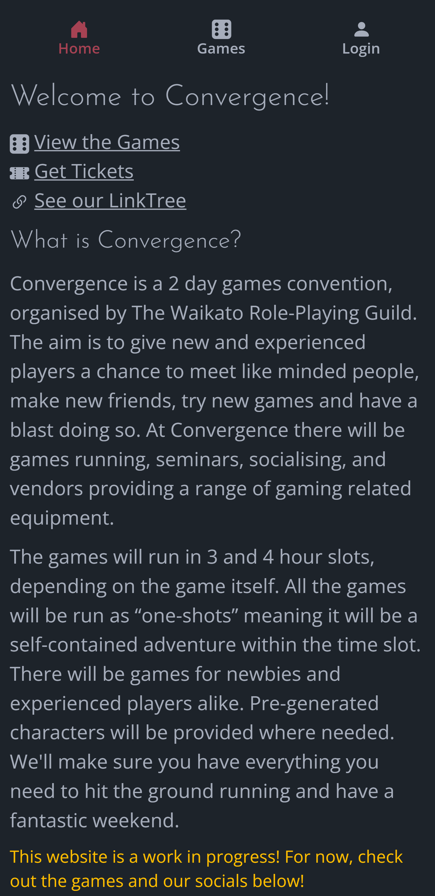

### Games

This is where you can see and filter all games.

Tapping on a game's 'card' takes you to more details about that game. Go back *(in your browser)* to return to where you were last looking.

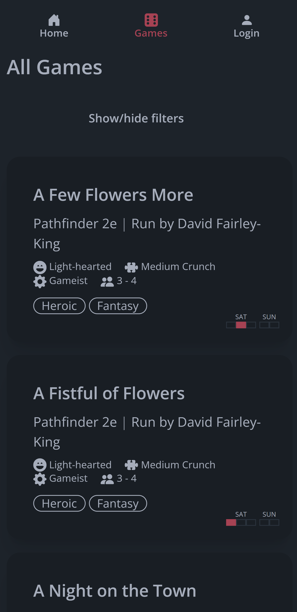
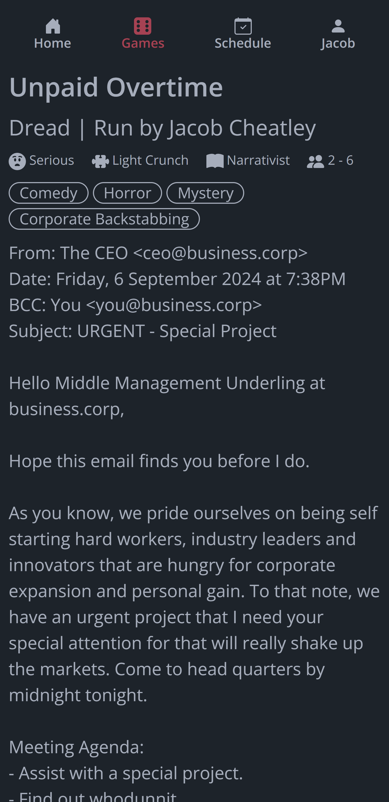

Tap 'show/hide filters' to open the filters.

If you have selected something within a filter category, any game with that value will be visible. If you've selected multiple values, it's not an 'and' it's an 'or' - any game with *any* of those values will be visible. If you haven't selected anything, no filtering will be done on that category (it's the same as ticking everything).

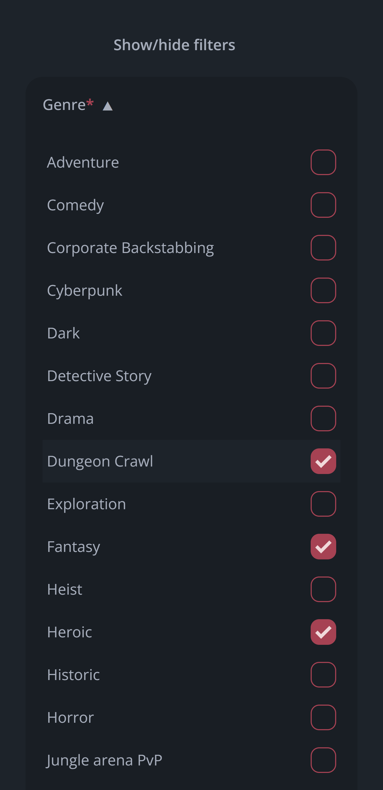

### Login/Sign Up and Profile

In order to edit your schedule and preferences, you need to log in - we're a pretty trusting bunch, so there's no passwords to manage - your email is your identity. If you're a GM at Convergence 2024, your email should already be there, and you'll be told to log in directly.

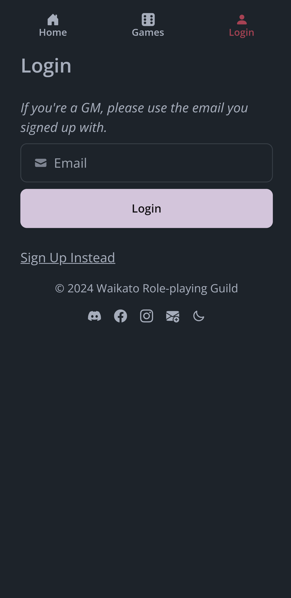
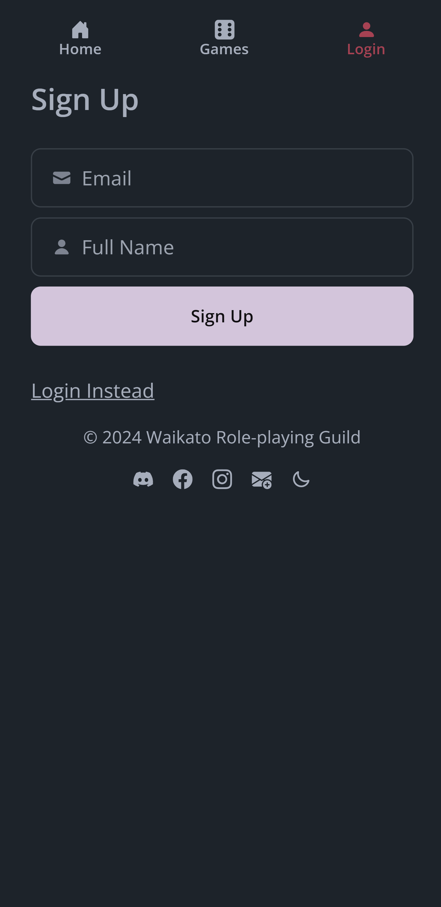

Once you've logged in, in your profile you can see how many golden d20s you have, and edit your name. This is also where you log out (important on shared devices)!

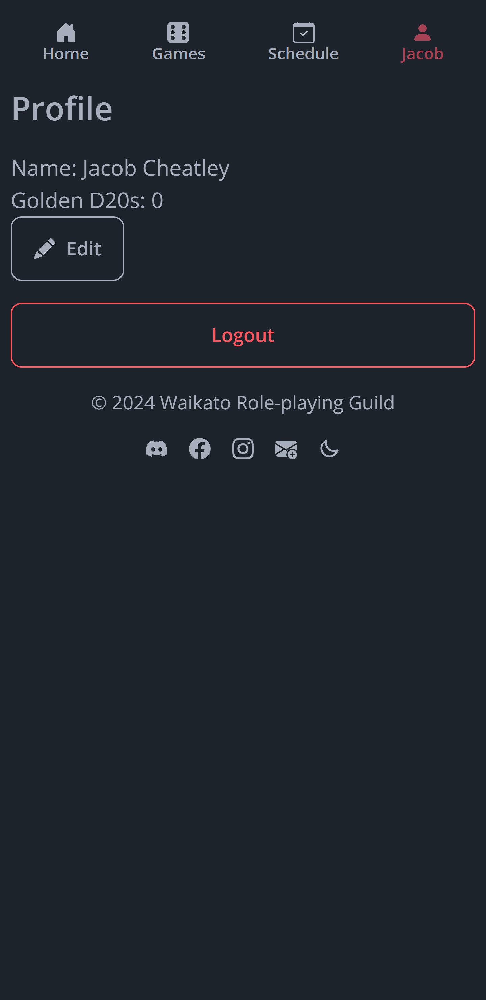

### Schedule

This is where you can plan your sessions - who you're playing with, and what you want to play!

You can select which session (Saturday Morning -> Sunday Night) you're setting up with the top drop down. *Everything else you select here only applies for that one session - your groups and preferences **DO NOT** carry between sessions.*

If you're GMing in a session, you'll see the game you should be running. You can still set preferences, just in case there aren't enough players for your game to run, and you become a player.

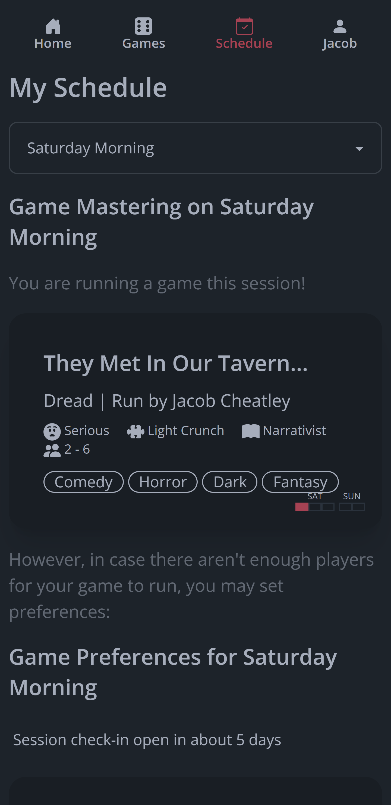

You can tap on a die size (0 to d12, or d20 if eveyone in your group has a golden d20) to set your preference. It's instantly updated in the back end, the latest change applies.

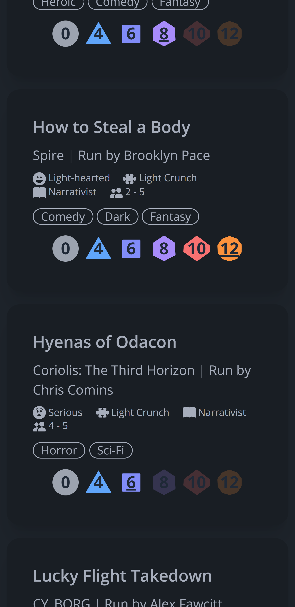

You can form an adventuring party of 1 (lone wolf!), 2 or 3 players by sharing party codes. By default you'll have a random 6 letter code, but you can change it. Once another player has joined your group with the code you've shared, you'll have to refresh to see them.

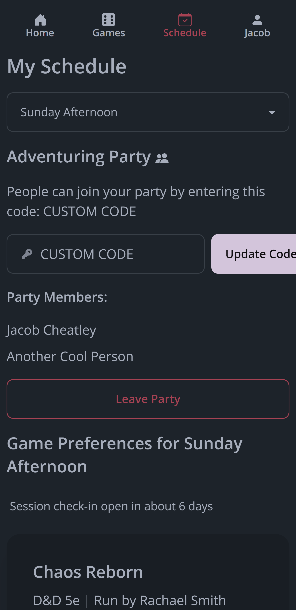
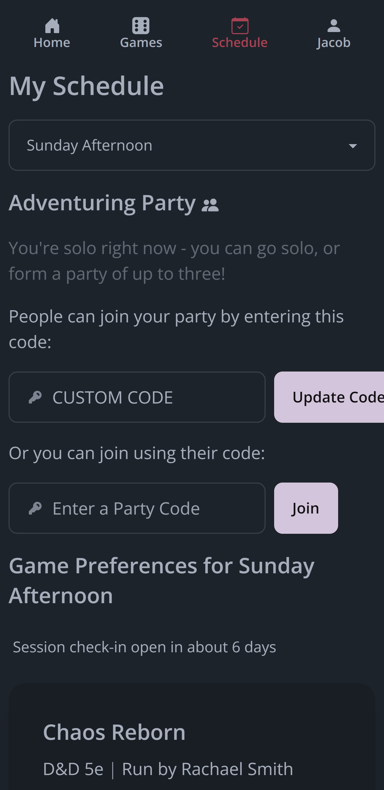

Once an allocation has been done by the admins, you'll see what table you're at - go play!

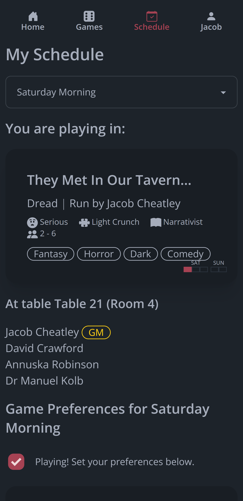